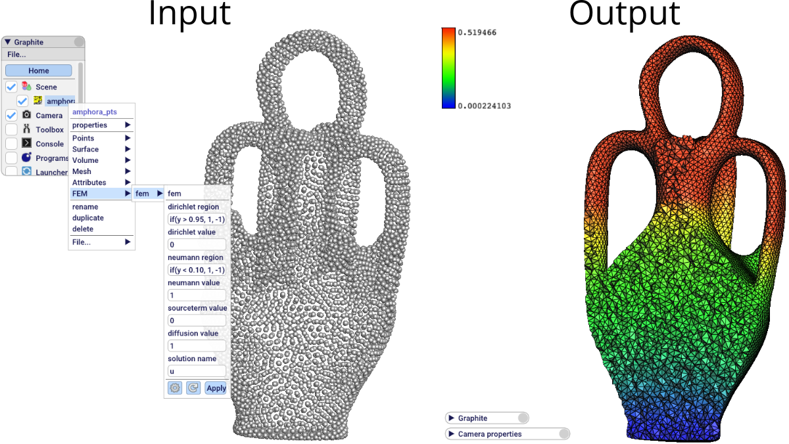

# femb: basic FEM with Graphite

This is a *Graphite* plugin that implements P1 FEM for Poisson equation on tetrahedral meshes.

The interest of this code is mainly to show how to use the Geogram and Graphite
APIs, functions and classes. The FEM part is very basic and simple.

If you want to learn how to develop a plugin for *Graphite* and *Geogram*, please use the
[tutorial](docs/tutorial.md) associated to this plugin.

If you are only interested in the FEM implementation (~200 lines), you can directly look 
at the file `algo/femb.cpp`

Validation: same results than with *MFEM* on `sinbump_test.lua` and `neumann_test.lua`

### Installation

Assuming that you have a working *Graphite* setup, the steps are:

    // get the plugin source code
    mkdir /path/to/this/plugin
    git clone https://github.com/mxncr/femb.git /path/to/this/plugin

    // tell graphite to build the new plugin
    ln -s /path/to/this/plugin /path/to/graphite/plugins/OGF/femb
    echo "add_subdirectory(femb)" >> /path/to/graphite/plugins/OGF/Plugins.txt

Now you should:
- configure and build Graphite (which will build this plugin)
- launch Graphite, go to *Files > Preferences > Plugins*, enter *femb* and click *Add*, then *Save configuration file*
- restart Graphite, from now on you should have the *femb* plugin working (right click on a mesh in Scene and check if the FEM command menu is present)

### Run FEM simulations

Two possibilities:

**a)** From command line, you can load a mesh and run a Lua script. See the Lua scripts in `data/` for examples. This will open Graphite with the simulation output.

    graphite  data/cube_s12.meshb data/sinbump_test.lua 
    graphite  data/cube_s12.meshb data/neumann_test.lua 

**b)** From the Graphite GUI: open Graphite, load a mesh (right click on Scene), right click on the new mesh
and use the *FEM* menu.

After the simulation, a new mesh is created in the scene (with the suffix \_fem) with the solution as an vertex attribute (named `u` by default). Right click
on the new mesh and use the *Properties* menu to visualize the attributes.

### Problem specification

The Poisson problem is specified via explicit formulas thanks to the powerful math parsing and
evaluation library [ExprTk](https://github.com/ArashPartow/exprtk). See ExptTk documentation for
the complete list of supported functions.

Dirichlet BCs are specified by a region formula and by an evaluation formula. A mesh facet is considered Dirichlet if the 
dirichlet region formula is positive at its center. E.g.:

    dirichlet_region = "if (x < 0.1){1.} else if (z > 0.99){1.} else {-1.}"
    dirichlet_value  = "cos(x) * sin(z) - x^2"

Same for Neumann BCs:

    neumann_region = "if (x^2 + y^2 < 0.3^,1,-1)"
    neumann_value  = "cos(x) * sin(z) - x^2"

Diffusion coefficient and source term use only the evaluation formula:

    diffusion_value  = "if (z > 0.5, 10., -1)"
    sourceterm_value = "if ( (x-0.5)^2 + (y-0.5)^2 + (z-0.5)^2 < 0.1^2, 1., 0.)"

As `ExprTk` allows complicated evaluation functions, it is possible to define
complicated Poisson problems with this simple API.  There is no need to tags the
mesh facets before import. Regions are solely determined by the math formulas of the
problem definition.

### Example

In the following example, we start with the point cloud of an ancient amphora (`data/amphora_pts.meshb`).
The mesh-preprocessing step of the plugin takes care of building the tetrahedral mesh (surface reconstruction
of the boundary with `Geogram` algorithms and interior volume meshing with `TetGen`).  We apply the following Poisson problem:

    {
        dirichlet_region="if(y > 0.95, 1, -1)", 
        dirichlet_value="0", 
        neumann_region="if(y < 0.10, 1, -1)",
        neumann_value="1.", 
        sourceterm_value="0", 
        diffusion_value="1", 
        solution_name="u"
    }

Results:

See `data/amphora_test.lua` to launch the problem from command line.

